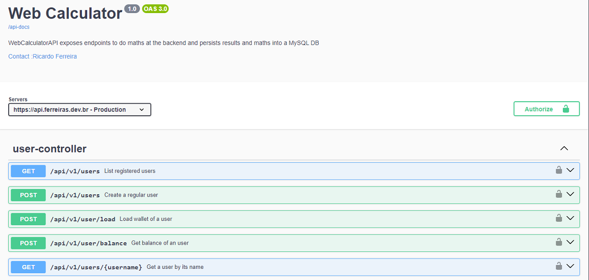

## _WebCalculator API Challenge_ <br />
I was challenged to develop a WebCalculator RESTful API and this is how I tackled it...

## _Table of contents_

- [_Overview_](#overview)
- [_Requirements_](#requirements)
- [_Project Structure_](#requirements)
- [_Howto Build and Run_](#requirements)
- [_Screenshot_](#screenshot)
- [_Links_](...)
- [_Built with_](#built-with)
- [_Code Snippet_](#requirements)
- [_Continued development_](#continued-development)
- [_Useful resources_](#useful-resources)
- [_Author_](#requirements)
- [_Portfolio_](#requirements)

## _Overview_

This app is an API calculator supporting basic math operations and providing a random string generator. 
The goal is to evaluate how a dev deals with this full stack challenge and builds a RESTful API to be consumed by a ReactJS-based 
front-end app available at <a href="https://webcalculator.ferreiras.dev.br" target="_blank">CalculatorWeb-UI</a>.
<br />

## _Requirements_

There are some specific requirements to be met, such as authentication and authorization, data persistence, 
paginated data recovery, consume services of other api -> <a href="https://random.org" target="_blank">Random.org API</a>, authenticated access to endpoints and some other requirements.<br />
<br />
The app has been coded using Java 21, Spring Boot 3.3.5, Gradle, Javadoc, Spring Security, Spring JPA, Spring Webflux,
Spring OAUTH2, Flyway, Jackson, Lombok, OpenAPI, PostgreSQL, Docker and hosted in an AWS EC2 instance with secure access provided
by a NGINX SSL proxy reverse and being live at <a href="https://api.ferreiras.dev.br/swagger-ui/index.html" target="_blank">CalculatorWeb-API</a> <br />
<br />
I will let you give it a try using these credentials to taste it: <br />
<b>username:</b> <i>example@example.com</i>, <b>password:</b> <i>example.com</i> <br />
<br />
Click at <a href="https://webcalculator.ferreiras.dev.br" target="_blank">WebCalculator-UI</a>, load 
these credentials, authenticate and get a credit of 100.00 to do your maths!<br />
Enjoy it....
<br />
Why don't you take a look at this short video....to see how it works...
<br />
<a href="https://youtu.be/CUdN-P-14So" target="_blank">Short Video</a>
<hr />

## _Project Structure_
- docs
   - javadocs
- src
    - main
    - java
        - br.dev.ferreiras.webcalculatorapi
            - config
            - controller
              - handlers 
            - dto
            - entity
            - enums
            - mapper
            - repository
            - services
              - exceptions
    - resources
        - db.migration
        - certs
    - test
-

## _Howto Build and Run_

  ```
  - PostgreSQL Database : http://127.0.0.1:5432
  - profile active: dev or prod
  - service socket: 127.0.0.1:8088
  - tweak a few knobs to get it up and running
  """
  src.main.java.br.dev.ferreiras.webcalculator.config.OpenApiConfiguration
  ...
  public class OpenApiConfiguration {
  @Bean
  public OpenAPI defineOpenApi() {
    Server server = new Server();
    -> server.setUrl("http://127.0.0.1:8088"); <-
    server.setDescription("Development");
   ....
  """
  
  To have a docker image follow the instructions of the dockerBuild.sh,
  otherwise just Ctrl-Shift-F10 and voila...

```

## _Screenshot_

[]()

## _Links_

- Live Site URL: <a href="https://api.ferreiras.dev.br/swagger-ui/index.html" target="_blank">API CalculatorWeb</a>

## _Built with_

[](https://skillicons.dev)

## _Code Snippet_

```java
import java.util.List;

/**
 * 
 * @author ricardo@ferreiras.dev.br
 * @version 1.1.030901
 * @since 1.0
 *
 */

@Configuration
public class OpenApiConfiguration {
  @Bean
  public OpenAPI defineOpenApi() {
    Server server = new Server();
    server.setUrl("https://api.ferreiras.dev.br/");
    server.setDescription("Development");

    Contact myContact = new Contact();
    myContact.setName(":Ricardo Ferreira");
    myContact.setEmail("ricardo@ferreiras.dev.br");

    Info information = new Info()
            .title("Web Calculator")
            .version("1.0")
            .description("WebCalculatorAPI exposes endpoints to do maths at the backend and persists them into a database")
            .contact(myContact);

    return new OpenAPI()
            .info(information)
            .addSecurityItem(new SecurityRequirement().addList("bearerAuth"))
            .components(
                    new Components()
                            .addSecuritySchemes("bearerAuth", new SecurityScheme()
                                    .type(SecurityScheme.Type.HTTP)
                                    .scheme("bearer")
                                    .bearerFormat("JWT")
                            )
            )
            .servers(List.of(server));
  }
}

``` 

## _Continued development_

- Unit Tests - NotOK
- Provide a Json to FrontEnd including
    - delivery status of each operation to frontend - OK
    - count of operations consumed by subscriber - OK
- Subscriber Authentication - OK
    - Spring JWT-OAuth2 - OK
- Records Pagination - OK

### _Useful resources_

- [https://spring.io] Awesome Java framework!.
- [https://start.spring.io/]  Handy startup tool.
- [https://mvnrepository.com] Tools that help tackle the beast

## _Author_
<a href="mailto:ricardo@ferreiras.dev.br">Ricardo Ferreira</a>

## - _Portfolio_
<a href="https://www.ferreiras.dev.br" target="_blank">My Portfolio...</a>

